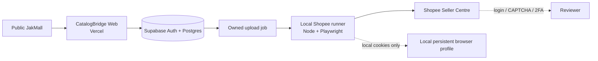

# Architecture

## Style

**Modular monolith** inside one Next.js repository.

The PoC does not need microservices. Separation should come from modules and interfaces, not deployment boundaries.

## Logical layers

```text
Browser UI
   ↓
Next.js routes / server actions
   ↓
Application services
   ├── JakMall adapter
   ├── Product normalization
   ├── Shopee mapper/integration adapter
   └── Process/history service
   ↓
Supabase
   ├── Postgres
   ├── Auth (if enabled)
   └── Storage (when needed)
```

## Local Shopee automation boundary



The web action creates an allowlisted snapshot only after reloading the owned
persisted READY state. The local runner signs in as that same CatalogBridge user,
so grants and RLS—not a service-role key—govern polling and status updates.
Shopee credentials, cookies, and session storage remain local. The runner is
single-job and fail-closed; automatic publishing is not represented in its state
machine.

## Suggested module boundaries

```text
src/
  app/
  components/
  features/
    products/
    imports/
    shopee/
    history/
  lib/
    supabase/
    validation/
    logging/
  modules/
    jakmall/
    normalization/
    shopee/
    pricing/
  types/
```

Use the current repository conventions if they are already cleaner. Do not reorganize the whole project for aesthetics.

## Dependency rules

- UI may call application/server APIs; UI must not parse JakMall HTML.
- JakMall adapter outputs source/normalized data; it does not know Shopee DOM/UI details.
- Normalizer is deterministic business logic wherever possible.
- Shopee mapper consumes normalized domain models.
- Supabase access should be centralized enough to enforce auth/security boundaries.
- Environment variables are accessed through a small validated configuration layer if complexity warrants it.

## External integration strategy

### JakMall

Default order:

1. normal HTTPS fetch;
2. structured data / embedded JSON;
3. semantic HTML parsing with Cheerio;
4. browser automation only if evidence proves the public page requires it.

### Shopee

Use an adapter boundary so the PoC can support the most realistic verified path without rewriting the domain model:

- prepared draft / export;
- mass-upload template if available and verified;
- official API if legitimate access exists;
- browser automation only as a documented fallback, never for bypassing authentication controls.

The implemented PoC fallback is an isolated local Playwright runner. Its exact
Save & Archive and archived-state controls are evidence-backed; the remaining
authenticated form fields must not be automated until their actual accessible
controls have been observed.

## Scaling explanation

If volume grows substantially:

- Postgres remains the primary database;
- move long-running import/upload jobs to a queue/worker;
- implement bounded concurrency and retry/backoff;
- add object storage lifecycle policies;
- add observability and alerting;
- rate-limit source access;
- separate browser automation workers if browser rendering becomes necessary.

Do not build these production-scale components for the PoC unless required.
